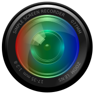

# Simple Screen Recorder Installation Script for Arch Linux

<p align="center">
  
</p>

This script automates the installation of the Simple Screen Recorder application on Arch Linux. It checks for required dependencies, clones the Simple Screen Recorder repository, and builds and installs the package.

## Features

- Checks and installs `git` and `gcc` if they are not already installed.
- Clones the Simple Screen Recorder repository from the Arch User Repository (AUR).
- Sets the necessary environment variables for the C and C++ compilers.
- Builds and installs the Simple Screen Recorder package using `makepkg`.

## Prerequisites

- An Arch Linux distribution.
- `sudo` privileges to install packages.

## Usage

### Step 1: Download the Script

Save the script to a file, for example, `install_simplerecorder.sh`.

### Step 2: Make the Script Executable

Open a terminal and run the following command to make the script executable:

```sh
chmod +x install_simplerecorder.sh
